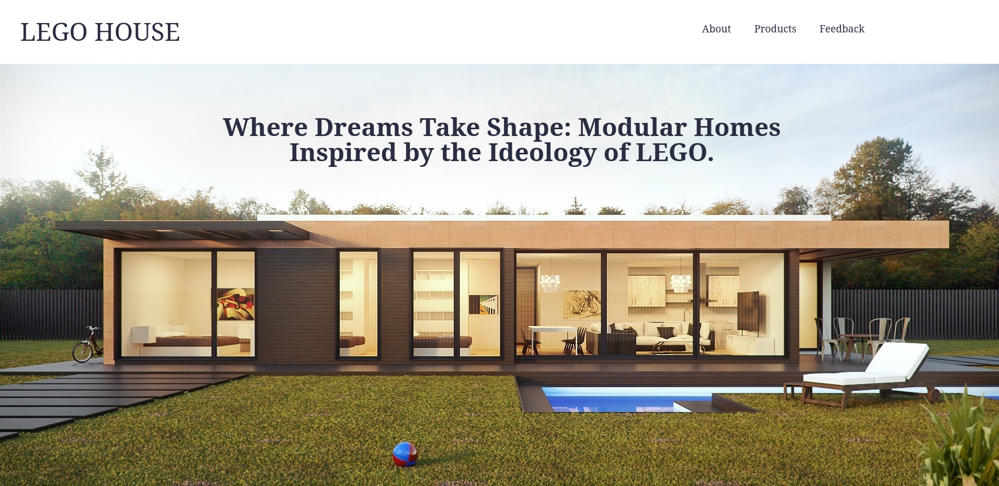
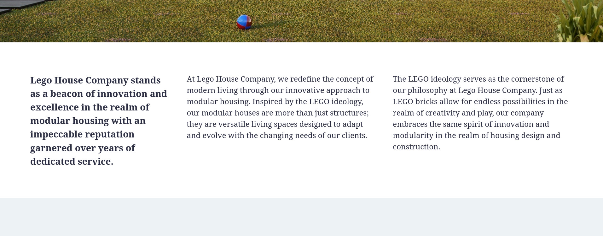
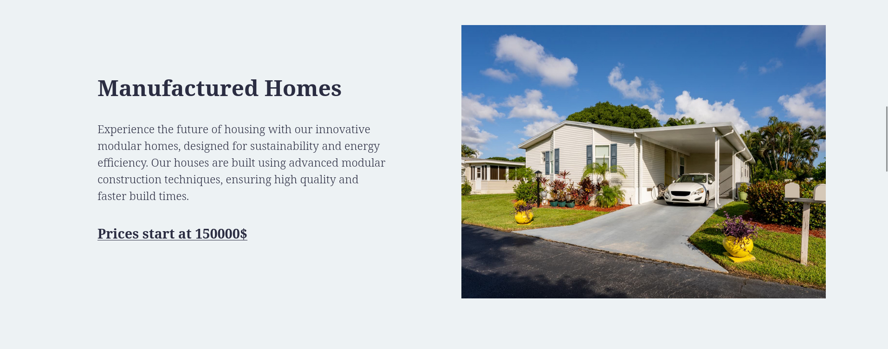
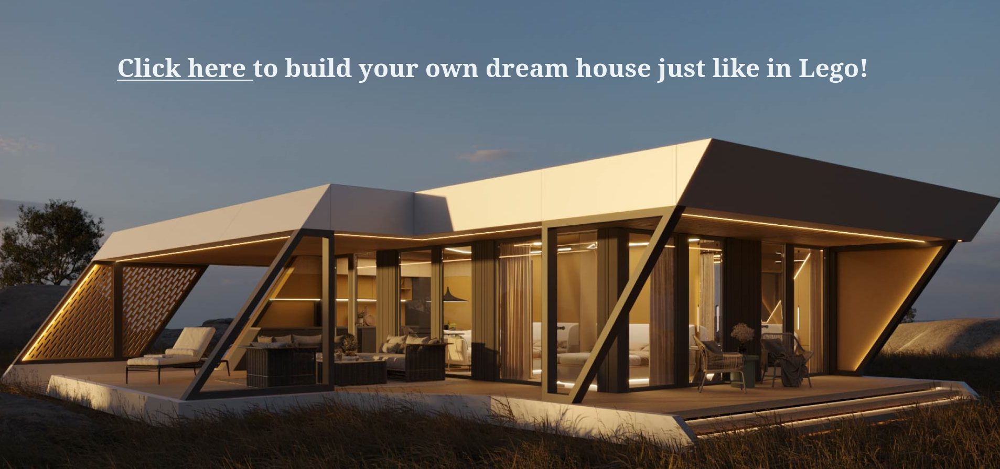
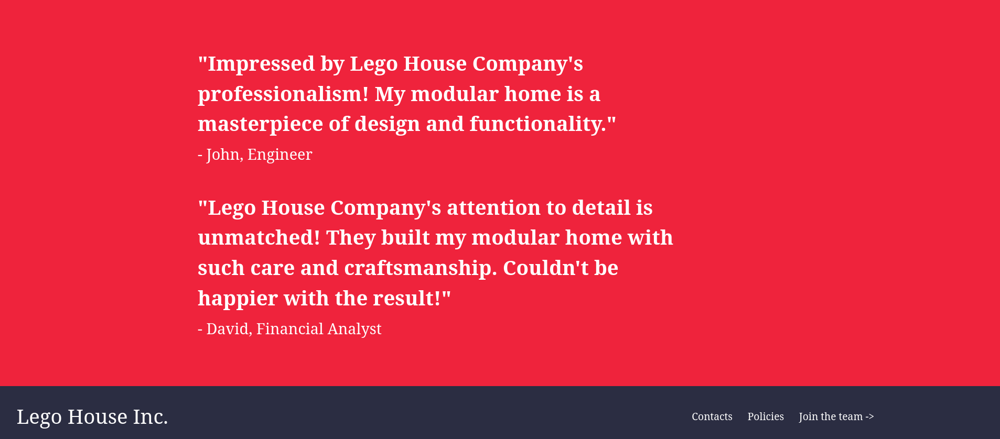

# Lego House (a Lego Scam Company)

This repo contains a plain HTML/CSS website which shows the description and features of the Lego House company which focuses on building prefab houses like Lego. The design of the website was inspired by the following resource: `https://qualmax.co.nz/`.

The website has several important sections and the header, footer respectively. Here is their short description:

* `About`

    The section includes a poster of a prefab home together with the 'hero' statement of the company. It captures the attention of the user when he/she visits the website for the first time. Below is presented a short description of the company's ideology and achievements.

    

    There categories listed in the header of the page are actually the links to the real sections of the website and can be accessed without any problems.

    

* `Products`

    In this section three categories of prefab homes are listed according to the convention presented in the screenshot below. The price is also indicated and represents actually a link which can possibly lead to a more detailed price list.

    

* `Call to action`

    This section contains only a poster with a provoking statement and a link which can be accessed in order to start designing a new prefab house.

    

* `Feedback`

    The last section on the page includes customers' feedback which indicates the reliability of the company.

    

    There is also a footer underneath which duplicates company's name from the header and offer the users some important links.
